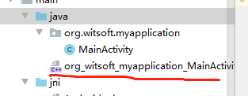

### 编写类
```
public class MainActivity extends AppCompatActivity {

    static {
        System.loadLibrary("test");
    }

    public static native String helloJni();

    public static native int addCalc(int a, int b);
}

```

### 生成类的头文件
```
cd app/src/main/java
javah -jni org.witsoft.myapplication.MainActivity
```


#### 复制文件到jni目录
复制后修改为test.h,然后编辑test.c

### 配置build.gradle
```
  externalNativeBuild {
        ndkBuild {
            path 'src/main/jni/Android.mk'
        }
    }

    buildTypes {
        release {
            minifyEnabled false
            proguardFiles getDefaultProguardFile('proguard-android-optimize.txt'), 'proguard-rules.pro'
        }
        debug {
            debuggable true
            minifyEnabled false
            ndk {
                abiFilters   "armeabi-v7a", "x86"
            }
        }
    }
```
###